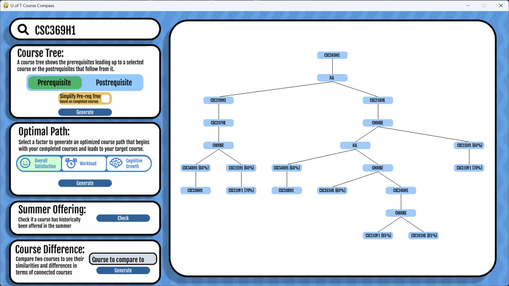
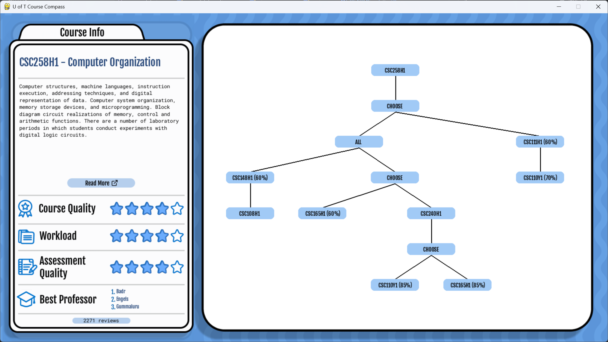
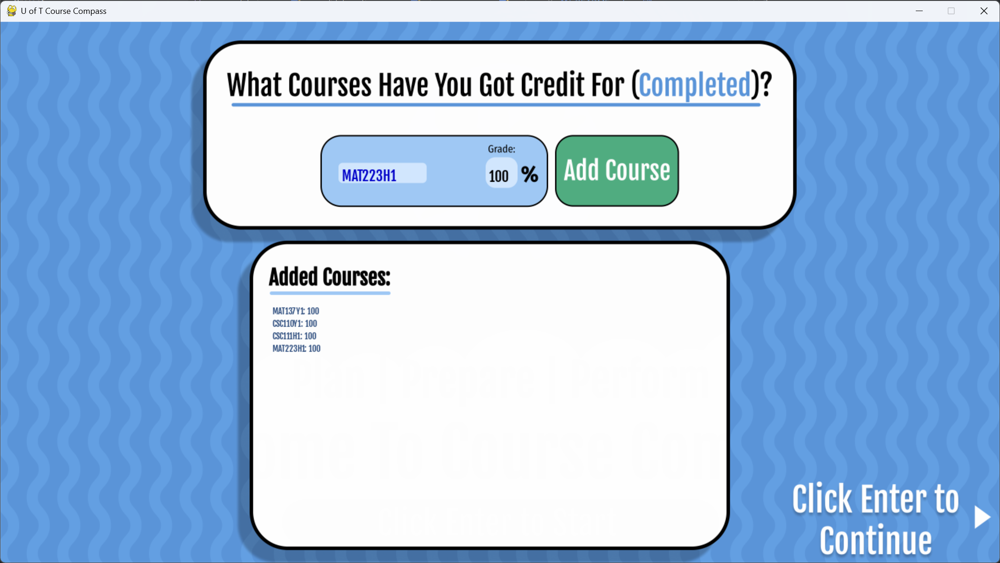
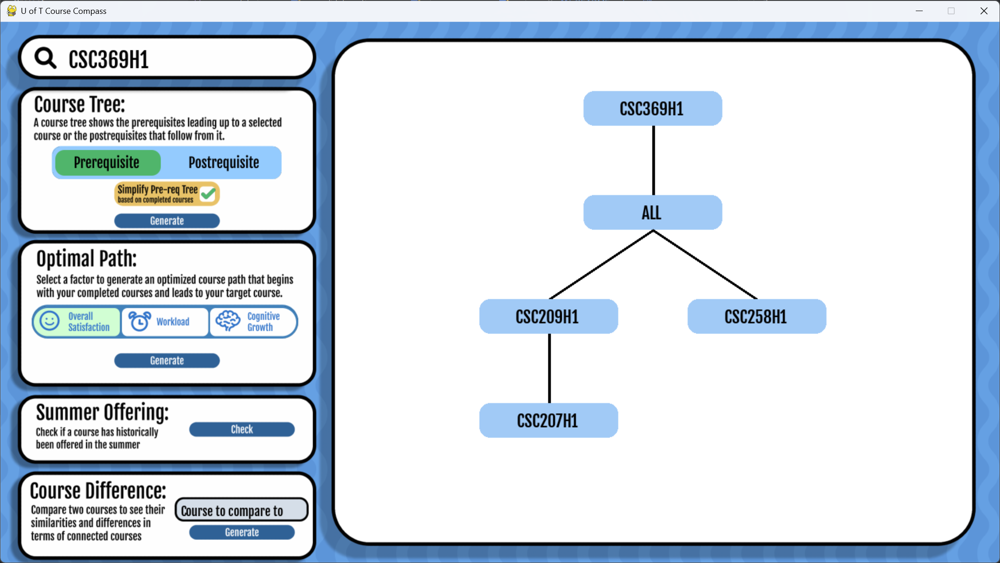
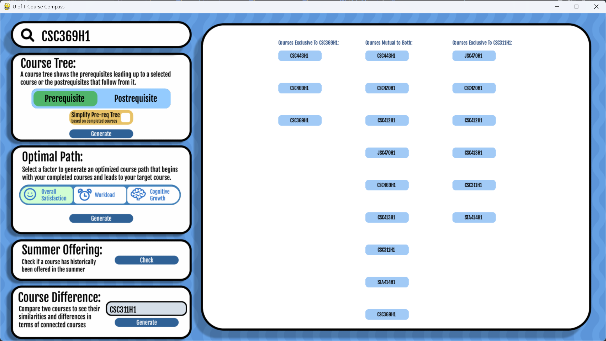
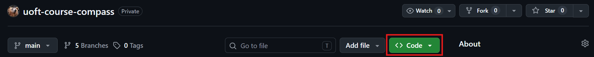
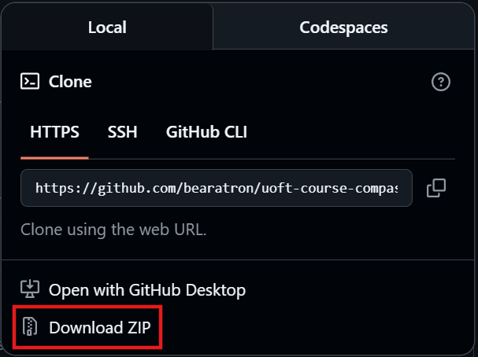

# uoft-course-compass

An interactive tool for visualizing course prerequisites, postrequisites, evaluation data, and more to aid students at the University of Toronto with course selection and planning.

A more detailed description can be found in our [project report](./project_report.pdf).

## Features

- **Prerequisite tree**: Visualize all the prerequisites for a particular course in an intuitive tree structure
- **Postrequisite tree**: See which courses a given course unlocks
- **Tree simplification**: Enter your completed courses to hide satisfied prerequisites from the tree
- **Course info**: Click any course node for its description, aggregated course evaluation metrics, and the top-rated professors
- **Optimal path**: Find the recommended course sequence for optimal course quality, workload, or cognitive growth
- **Summer offerings**: See whether a course has been historically offered in the summer
- **Course difference**: Compare the postrequisites of two courses side by side

Supported departments: Mathematics, Computer Science, Physics, Economics, Statistical Sciences

## Screenshots

<p align="center">
    
    <em>Splash screen</em>
</p>

<p align="center">
    
    <em>Prerequisite tree for CSC369H1</em>
</p>

<p align="center">
    
    <em>Course info for CSC258H1</em>
</p>

<details>
    <summary>View more screenshots</summary>
    <br>
    <p align="center">
        
        <em>Course input</em>
    </p>
    <p align="center">
        
        <em>Simplified prerequisite tree for CSC369H1 given the above course input</em>
    </p>
    <p align="center">
        
        <em>Course difference between CSC369H1 and CSC311H1</em>
    </p>
</details>

## Requirements
- Python 3.13 or newer
- Google Chrome (required if you want to run the course evaluations scraper)

## Install

### From the Web

1. Above the list of files, click the green **Code** button



2. Click **Download ZIP**



3. Extract the ZIP folder and open it in the command line

4. Install requirements: `pip install -r requirements.txt`

5. Run the program: `python main.py`

### From the Command Line
```bash
# Clone the repository
git clone https://github.com/bearatron/uoft-course-compass.git

# Navigate into the project folder
cd uoft-course-compass

# set up a virtual environment (recommended)
python -m venv venv
venv\Scripts\activate      # Windows
source venv/bin/activate   # macOS or Linux

# Install requirements
pip install -r requirements.txt

# Run the program
py main.py
```
